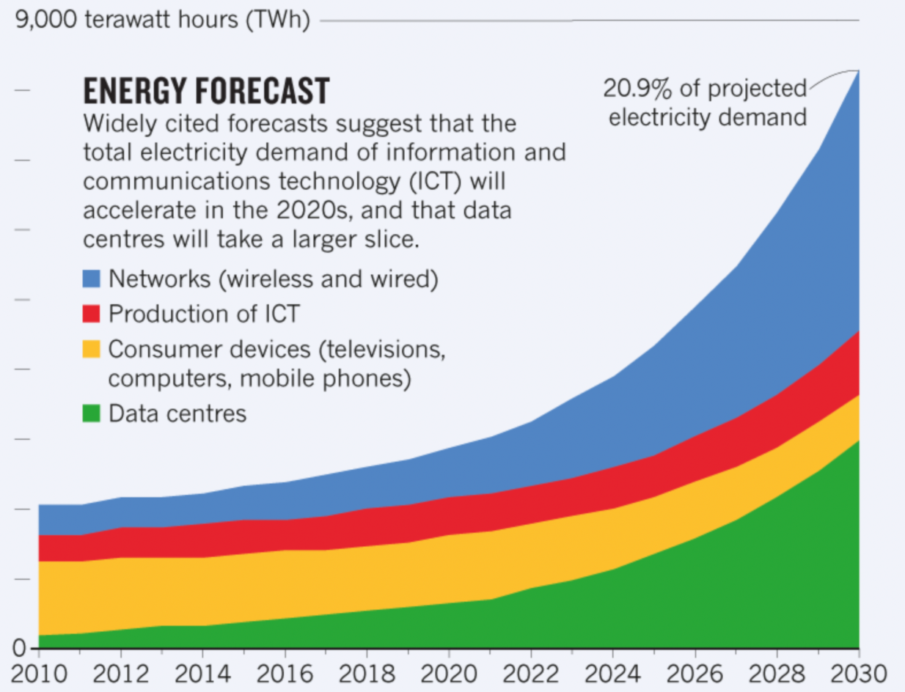
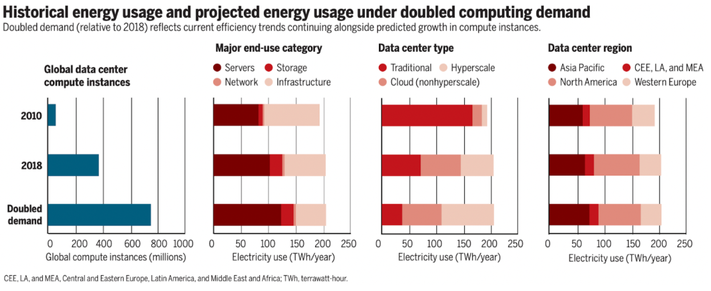
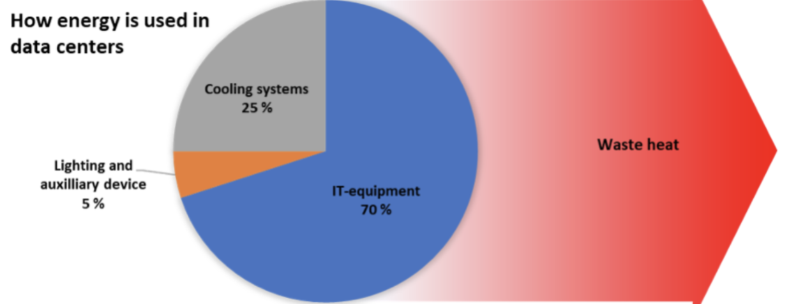
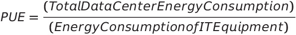
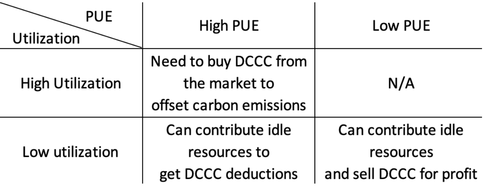

# Data Center Carbon Protocol について

From [Meson Network](https://meson.network/)

## 概要

デジタル経済の発展に伴いデータセンターは必需品となり、現代の生活を支えるコアなインフラとなっています。ムーアの法則によると、大規模なデータセンターはデータ転送量の増加に伴い、多くのエネルギーを消費することが知られています。一方、世界は気候変動の脅威にさらされており、データセンターは環境の悪化を加速させています。

MESONチームは査読付き専門誌を吟味し、世界的な地球温暖化抑制のための努力を経て、ここにデータセンターの炭素取引をサポートする媒体としてデータセンター・カーボン・クレジット（DCCC）を提案します。MESONネットワークはトークンによるインセンティブにより、遊休資源をより有効に活用し、国境、地域、プロジェクトを越えて帯域資源を調整することができます。また、メガデータセンターの建設を促進します。MESONは、世界のデータセンターが現代技術の発展や省エネ・排出削減のニーズに対応できるようにするための効果的なプラットフォームです。

## 炭素排出量とIDCの背景

### デジタル経済におけるデータセンターの重要性

データセンターはインターネットの「頭脳」とも言える存在です。ストリーミングビデオ、電子メール、ソーシャルメディア、オンラインコラボレーション、科学的コンピューティングなど、私たちが日々利用している無数の情報サービスの背後にあるデータを処理し、保存し、通信することを担っています。デジタルサービスは、エネルギー使用量の増加の主な原因となっています。今日、デジタルサービスの需要は着実に増加しており、それに伴ってインフラも整備されています。そしてインフラが増加すると、エネルギー需要も増加します。

### データセンターのエネルギー使用量の実態

データセンターの年間使用量は、推定200テラワット/時(TWh)です。これは、イランなどの国のエネルギー消費量、世界の輸送用電力消費量の半分、世界の電力需要の1％を超える量です。また、データセンターは世界の二酸化炭素排出量の約0.3%を占めています。

情報通信技術(ICT)の二酸化炭素排出量は、航空業界の燃料から排出される量に匹敵します。あるモデルでは、今生まれた子供が10代になる頃には、ICTによる電力使用量が世界の電力消費量の20％を超え、データセンターはその3分の1以上を占めると予測されています。

サーバーは主要なエンドユースであり、その殆どがハイパースケールデータセンターに統合されるでしょう。

ここ数年、エネルギー消費に関するレポートが多く発表されています。国際エネルギー機関(IEA)は、作業量とインターネットのトラフィックが2021年には2倍になるが、データセンターのエネルギー需要は効率化により横ばいになると報告しています。しかし、この主張に反論するレポートもありました。Uptime Institute Intelligence社は、データセンターのエネルギー消費を促進する強力な要因が存在すると考えています。中には、IEAの報告と矛盾するデータもあります。

IEAは、2018年の世界のデータセンターのエネルギー消費量は197.8TWhであり、2021年にはわずかに減少すると報告しています。しかし、EURECA(European Union Resource Efficiency Coordination Action)プロジェクトは、欧州のデータセンターが2017年に消費したのは130TWhであり、Greenpeaceは中国のデータセンターが2018年に消費したのは、160TWhであると推定しています。つまり、中国と欧州の両方だけで290TWhを消費したことになり、IEAが提供したデータをはるかに上回るものです。（https://journal.uptimeinstitute.com/data-center-energy-use-goes-up-and-up/)。

米国では、データセンターの収益性が低下しているため、省エネの効果が制限される可能性があります。データセンターレベルでは、ホットアイル/コールドアイルの封じ込め、ブランキングプレートの設置、セットポイント温度の引き上げなどのベストプラクティスがすでに広く導入されており、これは2011年から2014年にかけて電力使用効率(PUE)が大幅に低下したことからもわかります。しかし、2014年以降、PUEはあまり下がっていません。2019年には、世界のデータセンター調査の回答者から、年間平均PUEのわずかな上昇が報告されています。同様に、ITハードウェアでは、ムーアの法則が減速しています。新しいサーバーは、過去に見られたような効率向上を維持できていません。

Uptime Instituteでは、十分に理解された需要パターンと大規模な導入が進む既存技術を考慮して、IT部門の力強い成長は今後5年間にわたって維持されると予想しています。

### データセンターのエネルギー使用量増加の要因は？

クラウドやエンタープライズデータセンターの需要に加えて、5Gも大規模なインフラを必要とする分野です。5Gが普及するまでには数年かかると思われますが、5Gの展開によってデータの増加が大幅に加速し、スマートシティ、IoT、交通機関などの領域で新しいタイプのデジタルサービスが提供されることが期待されています。4Gに比べて帯域が広くなることで、2021年からは、より高解像度のコンテンツやリッチなメディアフォーマット(バーチャルリアリティなど)への需要が高まると考えられます。ソーシャルメディアは、エネルギー使用量の爆発的な増加にも貢献しています。Uptime Intelligence社の調査によると、ポルトガルのサッカースターであるクリスティアーノ・ロナウド(記事執筆時点で同プラットフォームのフォロワー数が最も多い)がInstagramに画像を投稿するたびに、彼の1億8800万人を超えるフォロワーがその画像を見るために24メガワット時(MWh)以上のエネルギーを消費していることがわかっています。世界のインターネットトラフィックの中で最も大きな割合を占めるメディアストリーミングは、インターネットのエネルギー消費源となっています。2.5時間のHD(高精細)映画のストリーミングでは1kWhのエネルギーを消費しますが、2021年に主流になると予想される4K(Ultra HD)ストリーミングでは3kWhに近づき、3倍になります。

そして、世界中に存在するデータセンターの帯域幅リソースプールを最大限に活用することで、データセンターのグローバルな二酸化炭素排出量を最小限に抑えることができます。現在、最も実行可能な方法は、より効率的な分散型システムを構築して帯域リソースを割り当てることです。

## プロトコルデザイン

Meson Networkは、データセンターの需要と世界の二酸化炭素排出量削減の需要の両方に対応するプロトコルを設計しています。データセンターは、ライフサイクル全体で二酸化炭素を排出します。建設段階では、データセンターは原材料(鉄鋼、セメントなど)、スタッフの配置、地域の土地や植生の天然資源の消費しますが、これらは建物建設の炭素排出量に抽象化され、各国の基準に準拠することができます。データセンターは、IT機器、冷却システム、照明、その他の付属部品に至るまで、運用時にさまざまな場面でエネルギーを消費します。

サーバーは、計算による熱が常に発生するため、一定の温度範囲内に収める必要があります。その熱を排出し、オペレーション全体の安全性を確保するためにも、冷却システムは欠かせません。データセンターのエネルギー効率の指標としては、PUEという統一されたパラメータがあります。

> Power Usage Effectiveness (PUE)。データセンターの効率性を表すのによく使われる指標。データセンターの総エネルギー消費量とIT機器のエネルギー消費量を関連付ける。

冷却システムには、大きく分けて3つの方法があります。

> **データセンター用冷却システムの概要**

> エアベースの冷却システム.このシステムでは、冷気がサーバールームに供給されます。空気の流れを制御し、冷気と熱気の混合を防ぐためサーバーラックは「コールド」と「ホット」と呼ばれる通路に配置されることが多いです。空気は熱容量や熱伝導率が低いため、熱を伝える媒体としてはあまり適していません。そのため、エネルギー消費量が多く、サーバーをコンパクトに配置することができず、廃熱温度も比較的低くなります。

> リキッドベースの冷却システム.マイクロチャネルで水を循環させ、サーバーコンポーネントに直接接触するコールドプレート熱交換器で熱交換を行うことで可能です。水や液体は一般的に、空気に比べて非常に優れた熱伝達特性を持っています。液体ベースの冷却システムは、データセンターをよりコンパクトにし、冷却のためのエネルギー使用量を減らして廃熱温度を高くすることができます。

> 2段階冷却.データセンターの新しい冷却技術です。ここでは、液体冷却剤がコールドプレート熱交換器で蒸発し、放散したエネルギーが潜熱として蓄えられます。これにより、熱流束や冷却水の戻り温度をさらに高めることができ、より高い計算密度のシステムが可能になります。

エネルギー消費の中核となるパラメータであるPUEに着目し、より環境に配慮したデータセンターの構築、利用、アップグレードを世界に促してエネルギー構造の悪いノードを制限したいと考えています。そこでMeson Networkは、データセンター・カーボン・クレジット(DCCC)を提案します。PUE指標を満たさないデータセンターでは、カーボンフットプリントを相殺するために、一定量のDCCCを購入する必要がありますが、PUEの高いノードでは、DCCCを流通市場で売却することができます。2つ目のパラメータは利用率です。世界中で建設されているデータセンターの稼働率は大きく異なります。PUEがそこそこで稼働率が低いデータセンターでは、遊休資源を資源共有市場(MESONなど)に接続してDCCCを取得し、DCCCを売却することで追加の利益（収入、例えばTeslaは炭素クレジットを売却することで約16億ドルを得ました）を得ることができます。PUEの低いデータセンターは、市場からDCCCを購入するか、アイドルリソースを共有してDCCCの差額を相殺する必要があります。

前述の2つのパラメータに加えて、もう1つの重要なパラメータは、データセンターに供給されるエネルギー構造です。今後のDCCCの発展においては、電力供給のエネルギー構造も重要なパラメータになる可能性があります。

## DCCCユースケース

MESONは、DCCCの利用をサポートする最初の市場となります。帯域集約・取引市場をボトムアップで構築することで、遊休帯域資源の問題を解決しようとしています。PUE基準を満たすノードは、MESONネットワークに資源を提供して一定量のDCCCを得ることができ、PUE基準を満たさないノードは、MESONネットワークに資源を提供してDCCCの残高を得ることができます。DCCCは、MESONでリソースを取引する際の重要なパラメータとなります。DCCCの基準を満たすノードは、リソース交換市場で優先されます。DCCCの基準を満たさないノードは、収入や取引の順位が制限されます。私たちは、世界のためのプラットフォームを創造し、このプラットフォームが人類の持続可能性に貢献することを願っています。

[https://www.instagram.com/p/BpPovnsFcO9/](https://www.instagram.com/p/BpPovnsFcO9/) 

## 需要側で支払うのか、供給側で支払うのか

炭素排出量の支払いは、供給側と需要側のどちらが行うべきかという議論が続いています。例えば、航空会社は二酸化炭素の排出量を支払うべきか、それとも乗客が支払うべきか？また、ビットコインの採掘者は二酸化炭素の排出量を、ネットワークを利用する人々に支払うべきか？(Bitmexは炭素クレジットを購入しています）。私たちは、両方のエンドが責任を負うべきだと考えています。需要側には自発的な働きかけが中心となり、供給側には一定の強制的な制約が必要となります。

## まとめ

PUE、稼働率、電源構成などの指標を導入し、DCCCを用いて具体的な測定を行うことで、データセンター次元でのCO2排出量取引に関する協定を結ぶことを提案します。協定自体はまだ初期段階なので、高い理想を持った多くの方々に、協定の議論やガバナンスに参加していただきたいと考えています。

Join the talk:[https://github.com/daqnext/DCCC](https://github.com/daqnext/DCCC) 

## 付録

- [Tesla Impact Report 2020](https://www.tesla.com/ns_videos/2020-tesla-impact-report.pdf)
- [Bitcoin’s Carbon Footprint](https://blog.bitmex.com/bitcoins-carbon-footprint)
- [Bill Gates:《How to Avoid a Climate Disaster》](https://blog.sintef.com/sintefenergy/this-is-how-we-reduce-data-centers-carbon-footprint/)
- [Trends in Data Centre Energy Consumption under the European Code of Conduct for Data Centre Energy Efficiency](https://www.mdpi.com/1996-1073/10/10/1470)
- [How to stop data centres from gobbling up the world’s electricity](https://www.nature.com/articles/d41586-018-06610-y)