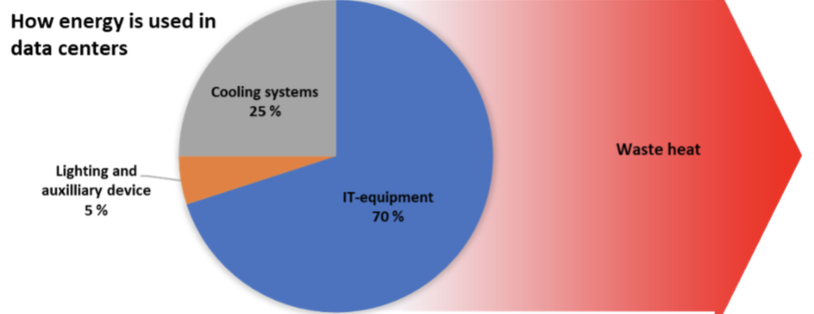

# 데이터센터 탄소 프로토콜

From [Meson Network](https://meson.network/)

## 요약

디지털 경제가 발전함에 따라 데이터센터는 현대 생활을 가능하게 하는 핵심 인프라인 필수품이 되었습니다. 무어의 법칙에 따라 대규모 데이터센터는 데이터 전송이 증가함에 따라 더 많은 에너지를 소비하는 것으로 알려져 있습니다. 그러나, 전 세계는 기후 변화의 위협을 받고 있으며 데이터센터는 우리 환경의 악화를 가속화하고 있습니다.

MESON 팀은 피어리뷰(동료평가) 저널에 대한 신중한 조사와 전 세계적으로 지구 온난화를 통제하기 위한 노력을 통해 데이터센터 탄소 거래를 지원하는 매체로 “데이터센터 탄소 배출권”(DCCC – Data Center Carbon Credit)을 제안했습니다. MESON 네트워크는 토큰 인센티브를 통해 유휴 자원을 더 잘 활용하고, 대역폭 자원을 국가별, 지역별 및 프로젝트 별로 효율적으로 배분할 수 있습니다. 또한 이를 통행 대형 데이터센터의 건설을 유도 할 수 있습니다. Meson은 글로벌 데이터센터들이 현대 기술의 발전에 맞게 발전하고, 에너지 보존 및 배출 감소의 요구 사항도 충족할 수 있도록 유도하는 효과적인 플랫폼입니다.

## 탄소 배출과 IDC 백그라운드

### 디지털 경제에서 데이터센터의 중요성

데이터센터는 인터넷의 "두뇌"로 간주될 수 있습니다. 데이터센터들의 역할은 스트리밍 비디오, 이메일, 소셜 미디어, 온라인 콜라보 또는 과학적 컴퓨팅 등 우리가 매일 의존하는 수많은 정보 서비스 이면의 데이터들을 처리, 저장 및 전달하는 것입니다. 디지털 서비스는 에너지 사용 증가의 주요 원인입니다. 디지털 서비스에 대한 수요는 꾸준히 증가하고 있으며 이에 따라 인프라도 발전하고 있습니다. 인프라가 증가함에 따라 에너지 수요도 증가합니다.

### 데이터센터는 실제로 얼마나 많은 에너지를 사용할까요?

데이터센터는 매년 약 200테라와트시(TWh)를 사용합니다. 이는 이란과 같은 국가의 국가 에너지 소비량, 세계 운송 전력 소비량의 절반, 세계 전력 수요의 1%를 초과하는 것입니다. 전체적으로 데이터센터는 전 세계 탄소 배출량의 약 0.3%를 차지합니다.

정보통신기술(ICT - Information and Communication Technology)의 탄소 배출량은 항공산업의 연료배출량과 비슷한 수준입니다.

가장 우려되는 예측에 따르면 오늘날 태어난 아이가 10대가 될 때 즘에는 ICT에 의한 전력 사용량이 전 세계 전력 소비량의 20%를 초과할 것이며 데이터센터가 ICT 전력 사용량 중 3분의 1 이상을 사용할 것이라고 합니다.

서버들은 주요 상품이 될 것이며, 대부분은 초대형 데이터센터에 통합될 것입니다.

지난 몇 년 동안 많은 에너지사용 관련 보고서가 발표되었습니다. 국제 에너지 기구(IEA - International Energy Agency)는 2021년에 워크로드와 인터넷 트래픽이 두 배로 증가할 것이라고 보고했지만 효율성 증가로 인해 데이터센터의 에너지 수요는 변함이 없을 것이라고 했습니다.

그러나 일부 보고서에서는 이러한 주장을 반박했습니다. “Uptime Institute Intelligence”는 데이터센터의 에너지 소비를 증가시키는 강력한 요인이 있을 것이라고 믿고 있습니다. 일부 데이터는 IEA의 데이터와도 다릅니다.

예를 들어, IEA는 전 세계 데이터센터 에너지 소비량이 2018년에 197.8TWh였으며 2021년에는 약간 감소했다고 보고했습니다. 그러나 European Union Resource Efficiency Coordination Action(EURECA) 프로젝트는 유럽 데이터센터가 2017년에 130TWh를 소비한 것으로, Greenpeace는 2018년 중국의 데이터센터가 160TWh를 소비한 것으로 추정합니다. 이는 중국과 유럽에서만 290TWh를 소비했으며 이는 IEA에서 제공한 데이터보다 훨씬 높은 수치입니다.( https://journal.uptimeinstitute.com/data-center-energy-use-goes-up-and-up/).

미국에서는 데이터센터의 수익이 줄어들고 있어서 에너지 절약 효과가 제한될 수 있습니다. 예를 들어 데이터센터들에는 열기/냉기 통로 차단, 블랭킹 플레이트 설치 및 설정 온도 상승과 같은 모범 사례가 이미 널리 배포되었습니다. 이는 2011년과 2014년 사이에 전력 사용 효율성(PUE - Power Usage Effectiveness)이 크게 하락한 것을 보면 알 수 있습니다. 그러나 2014년 이후로 PUE는 크게 떨어지지 않았습니다. 2019년에 글로벌 데이터센터 설문조사에 의하면 평균 연간 PUE가 약간 증가했다고 보고했습니다. 마찬가지로 IT 하드웨어의 경우 무어의 법칙이 느려졌습니다. 최신 서버는 과거와 동일한 효율성 개선 속도가 필요하지 않습니다.

하드웨어 최적화로 인해 수익이 감소하고 있다면, 향후 효율성 향상의 주요 이슈는 리소스 분배 시스템일 것입니다.

Uptime Institute는 이미 잘 알려진 수요패턴과 기존 기술의 대규모 채택을 고려할 때 IT 부문의 강력한 성장이 향후 5년 동안 지속될 것으로 예상합니다.

### 데이터센터의 에너지 사용 증가 요인은 무엇일까요?

클라우드, 코로케이션 및 엔터프라이즈 데이터센터의 수요 외에도 5G는 대규모 인프라가 필요한 또 다른 떠오르는 분야입니다.

5G가 성숙하고 보급되기까지는 몇 년이 걸리겠지만 5G의 출시는 스마트시티, IoT, 교통과 같은 영역에서 새로운 유형의 디지털 서비스와 함께 데이터 성장을 크게 가속화할 것으로 예상됩니다.

4G에 비해 더 큰 대역폭으로 더 높은 해상도의 컨텐츠와 더 풍부한 미디어 형식(가상 현실 등)에 대한 수요 증가로 이어질 것입니다.

소셜미디어 또한 에너지 사용의 폭발적인 증가에 기여합니다. Uptime Intelligence의 연구에 따르면 포르투갈 축구 스타 Cristiano Ronaldo(작성 당시 플랫폼에서 가장 많은 팔로워를 보유)가 Instagram에 이미지를 하나 게시할 때마다 1억 8,800만명이 넘는 그의 팔로워가 그 이미지를 보기 위해 24메가와트시(MWh) 이상을 소비의 에너지를 소비합니다.

전 세계 인터넷 트래픽의 가장 큰 부분을 차지하는 미디어 스트리밍은 인터넷의 주요 에너지 소비재가 되었습니다. 2.5시간짜리 고화질(HD- High Definition) 영화를 스트리밍 하는데 1kWh의 에너지가 소비되지만 4K(Ultra HD) 스트리밍의 경우 3kWh, 즉 3배나 증가합니다. 모든 글로벌 기존 데이터센터 대역폭 리소스 풀을 최대한 활용하면 데이터센터의 글로벌 탄소 배출을 최소화할 수 있습니다. 현재 가장 실행 가능한 방법은 대역폭 리소스 할당을 위해 보다 효율적인 분산 시스템을 구축하는 것입니다.

## 프로토콜 설계

Meson Network는 데이터센터 수요와 전 세계 탄소 배출량 감소 요구를 모두 수용하는 프로토콜을 설계합니다.

데이터센터는 수명 주기 전반에 걸쳐 탄소 배출이 이루어집니다. 건설 과정에서는 원자재(강철, 시멘트 등), 인력채용, 지역내 천연자원 소비 등 건물 건설에 따른 탄소 배출이 발생합니다.

데이터센터 운영에는 IT 장비, 냉각 시스템, 조명 및 기타 보조 부품에 이르기까지 여러 측면에서 에너지를 소비합니다.

컴퓨팅에서 발생하는 열로 인해 서버의 작동은 일정한 온도 제한 내에서 유지되어야 합니다. 냉각 시스템은 열을 방출하고 전체 작업의 안전을 보장하기 위해 필수적입니다. 데이터센터 에너지 효율성 지표로 PUE라는 통합된 매개변수가 있습니다:

> 전력 사용 효율성(PUE - Power Usage Effectiveness).데이터센터의 효율성을 설명하는 데 자주 사용되는 단위입니다. 데이터센터의 총 에너지 소비량 대비 IT 장비의 에너지 소비에 관련되어있습니다.PUE=(총 데이터센터 에너지 소비)/(IT 장비의 에너지 소비)

냉각시스템에는 주요 3가지 솔루션이 있습니다:

> **데이터센터를 위한 다양한 냉각 시스템**

> 공기기반 냉각시스템 공기기반 시스템에서는 서버실에 시원한 공기가 공급됩니다. 서버랙은 공기 흐름을 제어하고 찬 공기와 뜨거운 공기의 혼합을 제거하기 위해 보통 '냉기' 및 '열기' 통로를 구분하여 배치되는 경우가 많습니다. 열용량과 열전달 계수가 낮은 공기는 열을 전달하기에 좋은 매체가 아니기에 에너지 소비가 높아지고, 좁은 공간에 서버를 컴팩트하게 배치하기에 한계가 존재하며, 폐열온도가 다소 낮은 편입니다.

> 액체 기반 냉각 시스템은 물과 같은 액체를 사용하여 열을 발산합니다. 서버 구성요소와 직접 접촉하는 냉각판 열교환기에 마이크로 채널을 통해 물을 순환시켜 냉각이 이루어집니다. 물과 액체는 일반적으로 공기에 비해 훨씬 더 나은 열 전달 특성을 가지고 있습니다. 액체 기반 냉각 시스템을 사용하면 데이터센터를 더 컴팩트하게 만들고 냉각을 위한 에너지 사용을 줄이고 폐열온도를 높일 수 있습니다.

> 2상 냉각은 데이터센터 냉각 기술의 새로운 형태입니다. 여기서 액체 냉매는 냉각판 열교환기에서 증발하고 소멸된 에너지는 잠열(latent heat)로 저장됩니다. 이것은 더 큰 열유속과 냉매 반환 온도를 허용하고 훨씬 더 높은 컴퓨팅 밀도를 가진 시스템을 가능하게 합니다.

우리는 PUE의 핵심 에너지 소비 변수에 중점을 두고 전 세계가 보다 친환경적인 데이터센터를 구축, 사용 및 업그레이드하고 에너지 구조가 열악한 노드를 제한하도록 권장합니다.

따라서 Meson Network는 “데이터센터 탄소 배출권”(DCCC – Data Center Carbon Credit) 세트를 제안합니다. PUE 지수를 충족하지 못하는 데이터센터의 경우 탄소 배출을 상쇄하기 위해 일정량의 DCCC를 구매해야 하며, PUE가 더 나은 노드의 경우 DCCC를 2차 시장에서 판매할 수 있습니다.

두 번째 변수는 ‘사용률’입니다. 전 세계에 설립된 데이터센터의 사용률은 매우 다양합니다. PUE가 적절한데 활용률이 낮은 데이터센터의 경우 유휴 리소스를 리소스 공유 시장(예: MESON)에 연결, DCCC를 획득하고, 이를 판매하여 추가 이익을 얻을 수 있습니다(예: 테슬라는 탄소배출권 판매로 16억달러를 벌어들였습니다). 적절치 못한 PUE를 가진 데이터센터는 시장에서 DCCC를 구매하거나 DCCC의 부족분을 상쇄하기 위해 유휴 리소스를 공유해야 합니다.

위에서 언급한 두 가지 매개변수 외에도 또 다른 중요한 매개변수는 데이터센터에 공급되는 에너지 구조입니다. DCCC의 향후 개발에서 전원 공급 장치의 에너지 구조도 핵심 매개 변수가 될 수 있습니다.

## DCCC 사용 사례

MESON은 DCCC 사용을 지원하는 최초의 시장이 될 것입니다. MESON은 유휴 대역폭 자원의 문제를 해결을 위해 상향식 대역폭 집적 및 거래 시장을 구축할 것입니다.

PUE 표준을 충족하는 노드는 MESON 네트워크에 자원을 기부하여 일정량의 DCCC를 얻을 수 있고, PUE 표준을 충족하지 않는 노드는 MESON 네트워크에 자원을 기부하여 DCCC 균형을 얻을 수 있습니다.

DCCC는 MESON에서 자원 거래의 필수 매개변수가 될 것입니다. DCCC 표준을 충족하는 노드는 자원 교환 시장에서 우선권을 갖습니다. DCCC 표준을 충족하지 않는 노드는 제한된 수익과 거래 순위를 갖습니다. 우리는 세계를 위한 플랫폼을 만들고 이 플랫폼이 인류의 지속 가능성에 기여할 수 있기를 바랍니다.

[https://www.instagram.com/p/BpPovnsFcO9/](https://www.instagram.com/p/BpPovnsFcO9/) 

## 수요측에서 지불할 것인가, 아니면 공급측에서 지불할 것인가?

탄소배출권을 공급측에서 부담해야 하는지 수요측에서 부담해야 하는지에 대한 논쟁이 계속되고 있습니다. 다음과 같은 질문들이 있습니다. 항공사는 탄소배출권을 지불해야 할까요 아니면 승객이 지불해야 할까요? 발전소가 탄소 배출권을 지불해야 할까요 아니면 전기 사용자가 지불해야 할까요? 비트코인 채굴자가 지불해야 할까요, 네트워크 사용자가 지불해야 할까요? (Bitmex는 탄소 배출권을 구매합니다). 우리는 양쪽 모두가 책임을 져야 한다고 믿습니다. 수요 측면의 경우 자발적인 격려가 주요 초점이며 공급 측면에는 일정 부분 강제 제약이 필요합니다.

## 결론

우리는 데이터센터들의 탄소 배출권 거래에 대한 합의를 수립하고 PUE, 사용률 및 전원 공급 구조와 같은 지표를 도입한 DCCC를 사용하여 세부적인 측정을 수행할 것을 제안합니다. 합의 자체는 아직 초기 단계이며, 합의에 대한 논의와 거버넌스에 더 많은 사람들이 참여할 수 있도록 높은 이상을 가진 사람들이 참여하기를 바랍니다.

토론에 참여하세요:[https://github.com/daqnext/DCCC](https://github.com/daqnext/DCCC) 

## 참고문헌

- [Tesla Impact Report 2020](https://www.tesla.com/ns_videos/2020-tesla-impact-report.pdf)
- [Bitcoin’s Carbon Footprint](https://blog.bitmex.com/bitcoins-carbon-footprint)
- [Bill Gates:《How to Avoid a Climate Disaster》](https://blog.sintef.com/sintefenergy/this-is-how-we-reduce-data-centers-carbon-footprint/)
- [Trends in Data Centre Energy Consumption under the European Code of Conduct for Data Centre Energy Efficiency](https://www.mdpi.com/1996-1073/10/10/1470)
- [How to stop data centres from gobbling up the world’s electricity](https://www.nature.com/articles/d41586-018-06610-y)