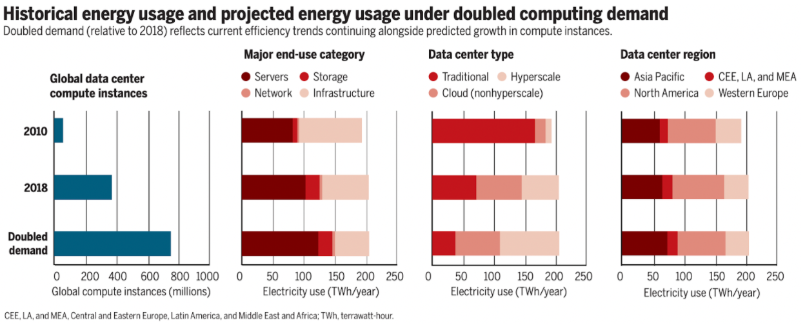

# Изучение вопроса о заключении соглашения о торговле квотами на выбросы углерода для центров обработки данных

From [Meson Network](https://meson.network/)

## Аннотация

По мере развития цифровой экономики, дата-центры становятся предметом первой необходимости, базовой инфраструктурой, которая делает возможной современную жизнь.Как известно, Согласно закону Мура, крупные дата-центры потребляют больше энергии по мере увеличения объема передачи данных. Однако, в то же время миру угрожает изменение климата, а дата-центры  ускоряют эту угрозу.

Благодаря тщательному изучению экспертной оценки по контролю над глобальным потеплением во всем мире, команда MESON предложила Data Center Carbon Credit(DCCC) в качестве средства поддержки трейдинга выбросами углерода в дата-центрах. Сеть MESON может лучше использовать запас неиспользуемых ресурсов и координировать ресурсы полосы пропускания между границами, регионами и проектами с помощью токенов. Он также поощряет строительство мега-центров обработки данных. Meson - это эффективная платформа, которая позволяет глобальным центрам обработки данных соответствовать развитию современных технологий и потребностям в энергосбережении и сокращении выбросов.

## Выбросы углерода и немножко о IDC

### Насколько важны дата-центры в цифровой экономике

Дата-центры можно считать «мозгом» Интернета. Их роль заключается в обработке, хранении и передаче данных, лежащих в основе бесчисленных информационных сервисов, на которые мы полагаемся каждый день, будь то стрим, электронная почта, социальные сети, совместная работа в Интернете или научные вычисления. Цифровые услуги - основная причина увеличения энергопотребления. Спрос на цифровые услуги неуклонно растет, за ним следует развитие его инфраструктуры. По мере роста инфраструктуры растет и спрос на энергию.

### Сколько энергии дата-центры по настоящему используют?

Дата-центры используют около 200 тераватт-часов (TWh) ежегодно. Это больше, чем национальное потребление энергии такими странами, как например  Иран, половина мирового потребления электроэнергии транспортом и 1% мирового спроса на электроэнергию. В целом на дата-центры приходится около 0,3% мировых выбросов углерода.

Углеродный след информационных и коммуникационных технологий (ИКТ) сопоставим с выбросами авиационной промышленности от топлива.
Одна из наиболее тревожных моделей предсказывает, что использование электроэнергии с помощью ИКТ превысит 20% мирового потребления электроэнергии к тому времени, когда ребенок, рожденный сегодня, достигнет своего подросткового возраста, а центры обработки данных будут использовать более одной трети этого объема.

Сервера будут основным конечным пользователем, и большинство из них будут интегрированы в гипер масштабируемый дата-центр.

За последние несколько лет было опубликовано множество отчетов о потреблении энергии. Международное энергетическое агентство (IEA) сообщило, что в 2021 году рабочие нагрузки и интернет-трафик вырастут вдвое, но спрос на энергию в центрах обработки данных останется неизменным из-за повышения эффективности.
 
Однако, некоторые сообщения опровергают это утверждение. Uptime Institute Intelligence полагает, что потребление энергии дата-центрами будет определяться серьезными факторами. Некоторые данные даже противоречат данным IEA.
 
Например, IEA  сообщило, что потребление энергии центрами обработки данных во всем мире составило 197,8 ТВтч(TWh) в 2018 году с небольшим падением в 2021 году. Но в European Union Resource Efficiency Coordination Action (EURECA) говорится, что европейские центры обработки данных в прошлом 2017 году потребляли 130 ТВтч(TWh), в то время как по оценкам Greenpeace , китайские дата-центры в 2018 году потребили 160 ТВт-ч(TWh). Это означает, что и Китай, и Европа потребили 290 ТВт-ч(TWh), что намного превышает данные, предоставленные IEA.
(https://journal.uptimeinstitute.com/data-center-energy-use-goes-up-and-up/)

В США дата-центры  имеют убывающую динамику, что может ограничить влияние экономии энергии. Например, на уровне дата-центров уже широко применяются передовые методы, такие как изоляция горячих / холодных коридоров, установка заглушек и повышение заданной температуры; это видно по значительному падению эффективности использования энергии (PUE) в период с 2011 по 2014 год. Однако с 2014 года PUE не сильно снизился. В 2019 году респонденты глобального опроса дата-центров сообщили о небольшом увеличении среднегодового показателя PUE. Точно так же в отношении ИТ-оборудования закон Мура замедлился. Новые серверы не обеспечивают тех улучшений эффективности, которые наблюдались в прошлом.
 
Если оптимизация оборудования дает убывающую отдачу, то оптимизация системы распределения ресурсов является основным источником повышения эффективности в будущем.

Uptime Institute ожидает, что в течение следующих пяти лет, рост в ИТ-секторе будет устойчивым, учитывая хорошо изученные модели спроса и существующие технологии, которые получают широкое распространение.

### Что движет растущим потреблением энергии в дата-центрах ?

Помимо спроса со стороны облачных технологий, коллокации и корпоративных центров обработки данных, 5G является еще одним растущим сектором, который требует крупномасштабной инфраструктуры.

Хотя 5G потребуется несколько лет, чтобы стать зрелым и получить широкое распространение, ожидается, что развертывание 5G существенно ускорит рост данных за счет новых типов цифровых услуг в таких областях, как умные города(smart cities), Интернет вещей(IoT) и транспорт.

Большая пропускная способность по сравнению с 4G приведет к растущему спросу на контент с более высоким разрешением и более богатые медиа-форматы (например, виртуальную реальность), начиная с 2021 года.
 
Социальные сети также способствуют взрывному росту потребления энергии. Исследование Uptime Intelligence показывает, что когда португальская звезда футбола Криштиану Роналду (у которого на момент написания статьи было больше всего подписчиков на платформе), каждый раз, когда публикует что-то в Instagram, его более 188 миллионов подписчиков потребляют более 24 мегаватт-часов МВтч(MWh) энергии для его просмотра.

Потоковое мультимедиа(стриминг), которое составляет самую большую долю глобального интернет-трафика, стало пожирателем энергии. Для потоковой передачи 2,5-часового фильма высокой четкости (HD) требуется 1 киловатт-час кВтч(MWh) энергии, но для потоковой передачи 4K (Ultra HD), которая, как ожидается, станет более распространенной в 2021 году, эта цифра будет ближе к 3 кВтч(MWh), т.е. кратное увеличение. Максимальное использование существующего глобального пула ресурсов полосы пропускания дата-центров также, может минимизировать глобальный углеродный след дата-центров. Самый жизнеспособный способ прямо сейчас - построить более эффективные распределенные системы для распределения ресурсов пропускной способности(bandwidth ).

## Дизайн протокола

Meson Network разрабатывает протокол, который удовлетворяет потребности дата-центров и потребность в сокращении глобальных выбросов углерода.

Дата-центры производят выбросы углерода на протяжении всего своего жизненного цикла. В процессе строительства, они потребляют сырье (например, сталь, цемент и т. Д.), уничтожают природные ресурсы местных земель и растительности, которые могут быть отнесены к выбросам углерода при строительстве зданий и соответствуют требованиям. со стандартами разных стран.

Дата-центры во время работы потребляет энергию в нескольких аспектах, начиная от ИТ-оборудования, систем охлаждения, освещения и других вспомогательных частей.

Работа сервера должна поддерживаться в пределах определенного температурного лимита из-за постоянного тепла, выделяемого компьютером. Система охлаждения важна, потому что она отводит тепло и обеспечивает безопасность всей операции. Для показателей энергоэффективности существует единый параметр PUE:

> Power Usage Effectiveness (PUE).Метрика, которая часто используется для описания эффективности дата-центров. Он связывает их общее энергопотребление с энергопотреблением ИТ-оборудования: PUE = (общее энергопотребление дата-центра) / (энергопотребление ИТ-оборудования).

Для системы охлаждения существует примерно три основных решения:

> Системы воздушного охлаждения:В этих системах холодный воздух подается в серверные. Стойки для серверов часто располагаются в так называемых «холодных» и «горячих» коридорах, чтобы контролировать воздушный поток и исключать смешивание холодного и горячего воздуха. Из-за низкой теплоемкости и коэффициента теплопередачи, воздух не является очень хорошей средой для передачи тепла, что приводит к высокому потреблению энергии, ограничению компактности размещения серверов и относительно низкой температуре отходящего тепла.

> Водяное охлаждение:используется жидкость, например вода, для отвода тепла. Это может быть достигнуто путем циркуляции воды в микроканалах и обмена теплом в холодных пластинчатых теплообменниках, которые находятся в непосредственном контакте с компонентами сервера. Вода и жидкости в целом имеют значительно лучшие свойства теплопередачи по сравнению с воздухом. Системы охлаждения на основе жидкости позволяют создавать более компактные центры обработки данных, снижать потребление энергии для охлаждения и повышать температуру отходящего тепла.

> Двухфазное охлаждение:это развивающаяся форма технологии охлаждения дата-центров. Здесь жидкий хладагент испаряется в пластинчатом теплообменнике, а рассеиваемая энергия сохраняется в виде скрытого тепла. Это обеспечивает еще большие тепловые потоки и температуру возврата охлаждающей жидкости, а также делает возможными системы с еще более высокой вычислительной плотностью.

Сосредоточившись на основном параметре энергопотребления PUE, мы надеемся побудить мир строить и использовать более экологичные дата-центры, и ограничивать сервера с плохими структурами энергопотребления.

Поэтому Meson Network предлагает набор углеродных кредитов для центров обработки данных (DCCC). Для дата-центров, которые не соответствуют индексу PUE, необходимо приобрести определенное количество DCCC, чтобы компенсировать их углеродный след, в то время как для узлов с лучшим PUE DCCC можно продать на вторичном рынке.

Второй параметр - коэффициент использования. Коэффициенты использования дата-центров, построенных по всему миру, сильно различаются. Для центров обработки данных с приличным PUE и низким коэффициентом использования неиспользуемые ресурсы могут быть подключены к рынкам совместного использования ресурсов (таким как MESON) для получения DCCC и дополнительных преимуществ (доход, например, Tesla заработала около 1,6 млрд долларов за счет продажи квот на выбросы углекислого газа). получен от продажи DCCC. Центрам обработки данных с низким PUE необходимо приобретать DCCC на рынке или совместно использовать неиспользуемые ресурсы, чтобы компенсировать разницу в DCCC.

В дополнение к двум параметрам, упомянутым выше, еще одним важным параметром является структура энергии, подаваемой в дата-центрах. В будущем развитии DCCC энергетическая структура источника питания также может стать ключевым параметром.

## Возможное использование DCCC 

MESON станет первым рынком, поддерживающим использование DCCC. MESON пытается решить проблему неиспользуемых ресурсов полосы пропускания(bandwidth ) путем создания рынка агрегации полосы пропускной способности и транзакций снизу вверх.

Сервера, которые соответствуют стандарту PUE, могут вносить ресурсы в сеть MESON для получения определенного количества DCCC, а те, которые не соответствуют стандарту PUE, могут вносить ресурсы в сеть MESON для получения баланса DCCC.

DCCC станет важным параметром торговых ресурсов в MESON. Узлы, соответствующие стандарту DCCC, получают приоритет на рынке замещения ресурсов. Узлы, не соответствующие стандарту DCCC, имеют ограниченный доход и ограниченный рейтинг транзакций. Мы надеемся создать платформу для всего мира и надеемся, что эта платформа может способствовать устойчивости человечества.

[https://www.instagram.com/p/BpPovnsFcO9/](https://www.instagram.com/p/BpPovnsFcO9/) 

## Оплата со стороны спроса или предложения?

Споры о том, должна ли сторона спроса или предложения платить за выбросы углерода, продолжаются. Такой вопрос, как: должны ли авиакомпании платить за выбросы углерода, или пассажиры? Платит ли электростанция за выбросы углерода, или пользователь электроэнергии; Должны ли майнеры биткойнов платить за выбросы углерода, или те кто пользуется сетью? (Bitmex покупает углеродные кредиты). Мы считаем, что обе стороны должны нести ответственность. Со стороны спроса главное внимание уделяется добровольному поощрению, а со стороны предложения требуются определенные обязательные ограничения.

## ЗАКЛЮЧЕНИЕ

Мы предлагаем заключить соглашение о торговле выбросами углерода в дата-центрах, ввести такие показатели, как PUE, коэффициент использования и структура энергоснабжения, а также использовать DCCC для проведения конкретных измерений. Само соглашение все еще находится на начальной стадии, и мы надеемся привлечь больше людей с высокими идеалами для участия в обсуждении и управлении соглашением.

Присоединяйтесь к обсуждению:[https://github.com/daqnext/DCCC](https://github.com/daqnext/DCCC) 

## Ссылки

- [Tesla Impact Report 2020](https://www.tesla.com/ns_videos/2020-tesla-impact-report.pdf)
- [Bitcoin’s Carbon Footprint](https://blog.bitmex.com/bitcoins-carbon-footprint)
- [Bill Gates:《How to Avoid a Climate Disaster》](https://blog.sintef.com/sintefenergy/this-is-how-we-reduce-data-centers-carbon-footprint/)
- [Trends in Data Centre Energy Consumption under the European Code of Conduct for Data Centre Energy Efficiency](https://www.mdpi.com/1996-1073/10/10/1470)
- [How to stop data centres from gobbling up the world’s electricity](https://www.nature.com/articles/d41586-018-06610-y)