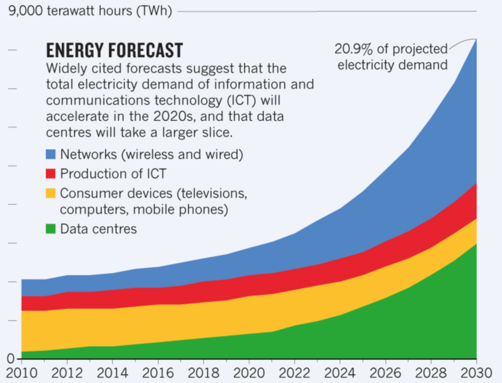

# Explore Data Center Carbon Credit Protocol(DCCC)

From Meson Labs

## Abstract

As the digital economy advances, data centers have become necessities, the core infrastructure that makes modern-day living possible. Per Moore’s Law, large data centers are known to consume more energy as data transmission increases. However, at the same time, the world is threatened by climate change, and data centers are accelerating the deterioration of our environment.

Through careful investigation of peer review journals and efforts to control global warming worldwide, the MESON team hereby proposed Data Center Carbon Credit(DCCC) as a medium to support data center carbon trading. The MESON network can better utilize the stock of idle resources and coordinate bandwidth resources across borders, regions, and projects through token incentives. It also encourages the construction of mega data centers. Meson is an effective platform that empowers global data centers to meet the development of modern technology and the needs of energy conservation and emission reduction.

## Carbon emissions and IDC background

### How important is the data center in the digital economy

The data center can be considered the “brain” of the Internet. Their role is to process, store, and communicate the data behind the countless information services we rely on every day, whether it’s streaming video, email, social media, online collaboration, or scientific computing. Digital services are the main reason for the increase in energy use. The demand for digital services has been steadily increasing, followed by the development of its infrastructure. As infrastructure increases, so makes the energy demand.

### How Much Energy Do Data Centers Really Use?

Data centers use an estimated 200 terawatt hours (TWh) each year. That is more than the national energy consumption of countries such as Iran, half of the global transportation electricity consumption, and 1% of global electricity demand. All in all, data centers contribute around to 0.3% of global carbon emissions.

Information and Communication Technology(ICT)’s carbon footprint is on a par with the aviation industry’s emissions from fuel.

One of the most worrying models predicts that electricity use by ICT would exceed 20% of the global electricity consumption by the time a child born today reaches her teens, with data centers using more than one-third of that.

Servers will be major end-use and most of which will all be integrated into hyperscale data center.

Many energy consumption reports have been published in the past few years. The International Energy Agency (IEA) reported that workloads and internet traffic would double in 2021, yet data centers’ energy demand will remain flat due to increased efficiency.

However, some reports refuted the claim. Uptime Institute Intelligence believes that there will be strong factors driving data centers’ energy consumption. Some data even contradicts that of IEA.

For example, the IEA reported that worldwide data center energy consumption was 197.8 TWh in 2018, with a slight drop in 2021. But the European Union Resource Efficiency Coordination Action (EURECA) Project said that European data centers consumed 130 TWh last 2017, while Greenpeace estimated that China’s data centers consumed 160 TWh in 2018. This means that both China and Europe alone have consumed 290 TWh which is far higher than the data provided by the IEA.（https://journal.uptimeinstitute.com/data-center-energy-use-goes-up-and-up/)

In the US, data centers have diminishing returns, which may limit the impact of energy savings. For example, at the data center level, best practices such as hot/cold aisle containment, installation of blanking plates and raising set point temperature have already been widely deployed; this can be seen in the substantial drop in power usage effectiveness (PUE) between 2011 and 2014. However, since 2014, PUE has not dropped much. In 2019, a slight increase in the average annual PUE was reported by respondents to a global data center survey. Similarly, with IT hardware, Moore’s law has slowed down. Newer servers are not maintaining the same efficiency improvements seen in the past.

If hardware optimization has been yielding diminishing returns, then optimization in the resource distribution system is the main source of efficiency improvement in the future.

Uptime Institute expects the strong growth in the IT sector to be sustained over the next five years, given the well-understood demand patterns and the existing technologies coming into large-scale adoption.

### What drives the increasing energy use of data centers?

In addition to the demand from cloud, colocation, and enterprise data center, 5G is another rising sector that requires large scale infrastructure.

While it will take a few years for 5G to mature and become widespread, it is widely expected that the rollout of 5G will substantially accelerate the data growth, with new types of digital services in domains such as smart cities, IoT, and transportation.
The larger bandwidth compared with 4G will lead to a growing demand for higher resolution content and richer media formats (e.g., virtual reality) starting in 2021.
Social media also contributes to the explosive growth of energy use. Research by Uptime Intelligence shows that every time an image is posted on Instagram by the Portuguese soccer star Cristiano Ronaldo (who at the time of writing had the most followers on the platform), his more than 188 million followers consume over 24 megawatt-hours (MWh) of energy to view it.

Media streaming, which represents the biggest proportion of global internet traffic, has become the energy guzzler of the internet. Streaming a 2.5-hour high definition (HD) movie consumes 1 kilowatt-hour (kWh) of energy, but for 4K (Ultra HD) streaming — expected to become more mainstream in 2021 — this will be closer to 3 kWh, a three-fold increase. To utilize the global existing data center bandwidth resource pool to the fullest extent can also minimize the global carbon footprint of data centers. The 
most viable way right now is to build more efficient distributed systems for bandwidth resource allocation.

## Protocol Design

The Meson Network designs a protocol that accommodates both the demand of the data center and the demand to reduce global carbon emissions.

Data centers generate carbon emissions throughout their lifecycle. During the construction process, data centers consume raw materials (such as steel, cement, etc.), staffing, and the destruction of the natural resources of the local land and vegetation, which can be abstracted into the carbon emissions of building construction and comply with the standards of various countries.

The data center consumes energy in several aspects during operation, ranging from IT equipment, cooling systems, lighting, and other ancillary parts.

The operation of the server needs to be kept within a certain temperature limit due to the constant heat generated from computing. The cooling system is essential because it discharges the heat and ensures the safety of the entire operation. For data center energy efficiency indicators, there is a unified parameter called PUE:

> **Power Usage Effectiveness (PUE)**
A metric that is often used to describe the efficiency of data centers. It relates the total energy consumption of a data centers to the energy consumption of the IT equipment: PUE=(total data center energy consumption)/(energy consumption of IT equipment)

For the cooling system, there are roughly three mainstream solutions:

> **Overview of different cooling systems for data centers**

> **Air based cooling systems** In these systems, cool air is supplied to the server rooms. The server racks are often arranged in so called ‘cold’ and ‘hot’ aisles, to control the airflow and eliminate mixing of cold and hot air. Due to low heat capacity and heat transfer coefficient, air is not a very good medium to transfer heat, which results in high energy consumption, limitations to how compact the servers can be placed and a relatively low waste heat temperature.

> **Liquid based cooling systems** use a liquid such as water to dissipate heat. This can be done by circulating water in micro channels and exchanging heat in cold plate heat exchangers which are in direct contact with the server components. Water and liquids in general have significantly better heat transfer properties compared to air. Liquid based cooling systems allows for more compact datacenters, reduced energy use for cooling and higher waste heat temperatures.

> **Two-phase cooling** is an emerging form of data center cooling technology. Here, the liquid coolant evaporates in the cold plate heat exchanger and the dissipated energy is stored as latent heat. This allows for even greater heat fluxes, and coolant return temperature and makes systems with even higher computational densities possible.

Focusing on the core energy consumption parameter of PUE, we hope to encourage the world to build, use, and upgrade data centers that are more environmentally friendly, and limit nodes with poor energy structures.

Therefore, the Meson Network proposes a set of Data Center Carbon Credit(DCCC). For data centers that do not meet the PUE index, a certain amount of DCCC needs to be purchased to offset their carbon footprint, while for nodes with better PUE, DCCC can be sold in the secondary market.

The second parameter is the utilization rate. The utilization rates of data centers built around the world vary greatly. For data centers with decent PUE and low utilization rate, idle resources can be connected to resource-sharing markets (such as MESON) to acquire DCCC and additional benefits(Revenue, e.g., Tesla earned around $1.6B through selling the carbon credit) can be obtained by selling DCCC. Data centers with poor PUE need to purchase DCCC from the market or share idle resources to offset the difference in DCCC.

In addition to the two parameters mentioned above, another important parameter is the energy structure supplied to the data center. In the future development of DCCC, the energy structure of the power supply could also become a key parameter.

## DCCC Use Case

MESON will become the first market to support the use of DCCC. MESON attempts to solve the problem of idle bandwidth resources by building a bandwidth aggregation and transaction market from the bottom up.

Nodes that meet the PUE standard can contribute resources to the MESON network to obtain a certain amount of DCCC, and nodes that do not meet the PUE standard can contribute resources to the MESON network to obtain the DCCC balance.

DCCC will become an essential parameter of trading resources in MESON. Nodes that fulfill the DCCC standard get priority in the market of resource replacement. Nodes that do not fulfill DCCC standard have limited income and ranking of transactions. We hope to create a platform for the world and hope that this platform can contribute to the sustainability of mankind.

[https://www.instagram.com/p/BpPovnsFcO9/](https://www.instagram.com/p/BpPovnsFcO9/) 

## Pay by the demand side or the supply side?

The debate on whether the Supply-side or Demand side should pay carbon emissions has been ongoing. The question such as: should airline companies pay for carbon emissions or passengers? Should the power plant pay for carbon emissions or the electricity user; Should Bitcoin miners pay for the carbon emission or those who use the network? (Bitmex buys carbon credits). We believe that both ends must be responsible. For the demand side, voluntary encouragement is the main focus, and certain mandatory constraints are required for the supply side.

## Conclusion

We propose establishing an agreement on carbon emissions trading in the data center dimension, introducing indicators such as PUE, utilization rate, and power supply structure, and using DCCC to make specific measurements. The agreement itself is still in its early stages, and we hope to attract more people with lofty ideals to participate in the discussion and governance of the agreement.

Join the talk:[https://github.com/daqnext/DCCC](https://github.com/daqnext/DCCC) 

## Reference

- [Tesla Impact Report 2020](https://www.tesla.com/ns_videos/2020-tesla-impact-report.pdf)
- [Bitcoin’s Carbon Footprint](https://blog.bitmex.com/bitcoins-carbon-footprint)
- [Bill Gates:《How to Avoid a Climate Disaster》](https://blog.sintef.com/sintefenergy/this-is-how-we-reduce-data-centers-carbon-footprint/)
- [Trends in Data Centre Energy Consumption under the European Code of Conduct for Data Centre Energy Efficiency](https://www.mdpi.com/1996-1073/10/10/1470)
- [How to stop data centres from gobbling up the world’s electricity](https://www.nature.com/articles/d41586-018-06610-y)